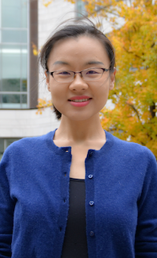

.. title: About Me
.. date: 
.. category: 
.. tags: 
.. slug: 
.. authors: Pengyin Shan

	

		

			<figure class="figure">
			  
			  <figcaption class="figure-caption">My <a href=".././PengyinShan_Resume.pdf">Resume</a></figcaption>
			</figure>
		

		

			

				

					

						I'm a first-year MBA student in Schulich School of Business, York University at Toronto, Canada. My main focus is <b>Artificial Intelligence</b> and <b>Digital Innovations</b>. I have four-years of experience in computer engineering.
					

					

					

						I enjoy learning anything from anyone. I spend most of my free time in reading and hiking. 
					

					

					
Feel free to find more about me by checking my <i>resume</i> or <i>LinkedIn</i> page.

					 
					 
				

			

		

	

